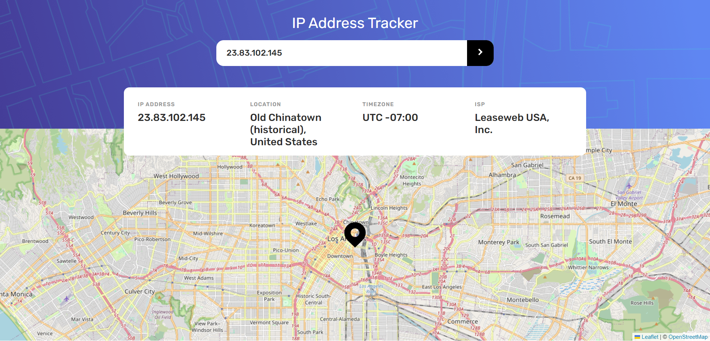
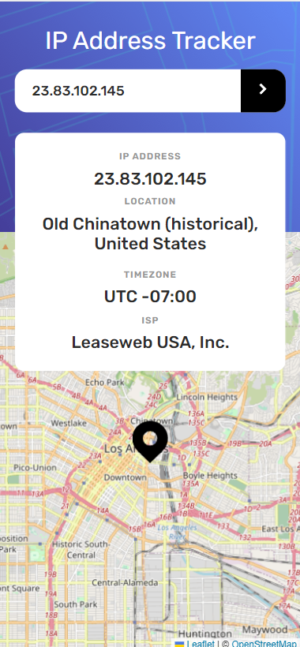

## Table of contents

- [Overview](#overview)
  - [Features](#features)
  - [Screenshot](#screenshot)
  - [Links](#links)
  - [Built with](#built-with)
- [Author](#author)
- [Acknowledgments](#acknowledgments)

## Overview

### Features

The IP Location Finder app is a tool that allows users to search for the location of an IP address and displays a marker on a map. The app is built with a variety of technologies, including Vite, TypeScript, Sass, Leaflet, and the IP Geolocation API.

The app is built with Vite, a fast and flexible build tool that enables quick and easy development of modern web applications. TypeScript is used to add static typing and other features to the app, enhancing its robustness and scalability. Sass is used to streamline styling and make it more maintainable.

The UI is build with Sass, a CSS pre-processor, and it's fully responsive and modern-looking

The app's map functionality is implemented with Leaflet, an open-source JavaScript library that provides a simple and powerful way of adding interactive maps to web pages. The IP Geolocation API is used to obtain the location of the searched IP address, including the city, country, and ISP.

The app also includes testing with Vitest. This ensures that all the features and functionalities of the app are working correctly, providing a high level of reliability and confidence for users.

### Screenshot

### Links

- Live Site URL: [Vercel](https://ip-tracker-d99f.vercel.app/)

### Built with

The app was built using a number of different technologies and tools, including:

- [Vite](https://vitejs.dev/): a fast build tool that allows for rapid development and quick feedback loops
- [TypeScript](https://www.typescriptlang.org/): a statically-typed superset of JavaScript that provides better code reliability and improved tooling
- [Sass](https://sass-lang.com/): a preprocessor scripting language that extends CSS and provides more features and flexibility
- [Vitest](https://vitest.dev/): a testing library specifically designed for use with Vite and Vue applications
- [Leaflet](https://leafletjs.com/): an open-source JavaScript library for mobile-friendly interactive maps.

## Author

Bozai Cosmin

## Acknowledgments

This is a solution to the [IP address tracker challenge on Frontend Mentor](https://www.frontendmentor.io/challenges/ip-address-tracker-I8-0yYAH0). Frontend Mentor challenges help you improve your coding skills by building realistic projects.
